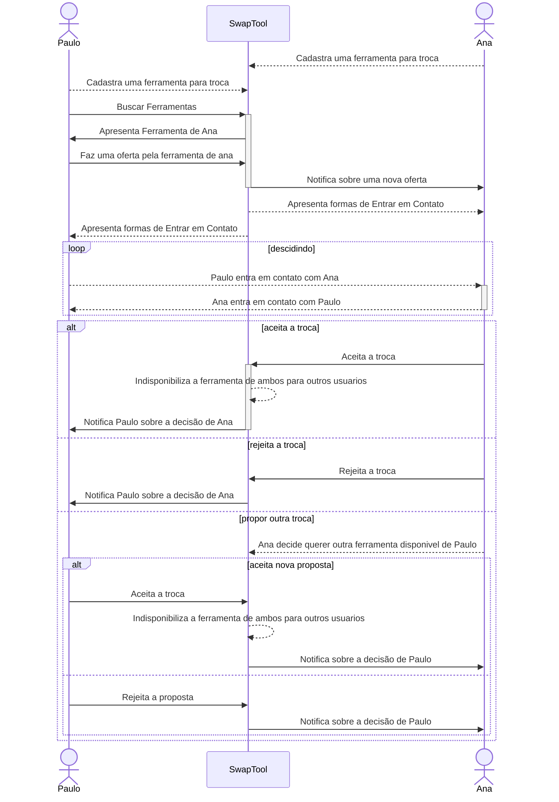
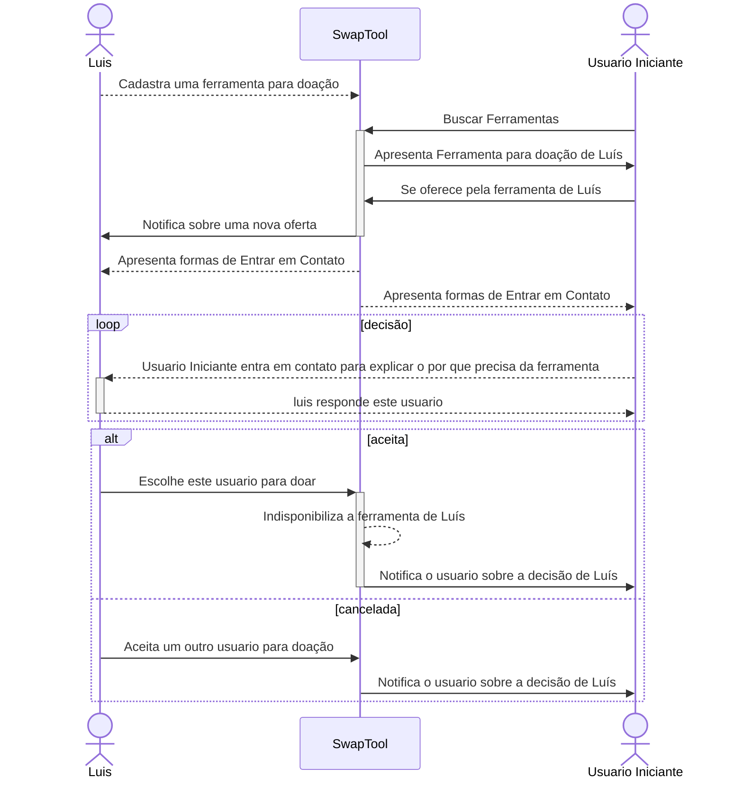
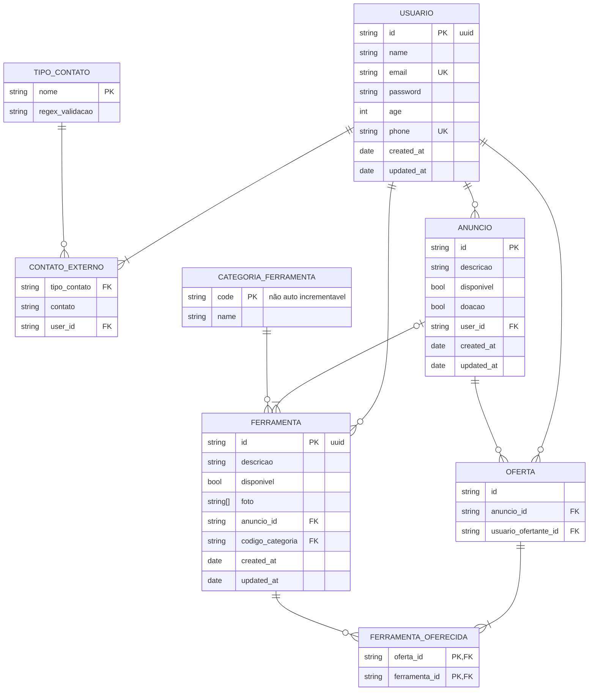

# SwapTool: Ferramentas novas, projetos novos!

## Descrição

      SwapTool funciona como um mercado de trocas, mas para ferramentas de trabalho! Conecta profissionais 
      como pedreiros, eletricistas, carpinteiros e outros, para que possam trocar ou doar suas ferramentas entre si.
      É uma forma inteligente de economizar dinheiro e recursos, ajudar uns aos outros, reduzir o desperdício e incentivar a
      reutilização de ferramentas de trabalho, antes inutilizadas.

### Benefícios:

- **Economize Dinheiro**: Troque suas ferramentas antigas ou desnecessárias por outras que você precisa, sem gastar um centavo.

- **Ajude a Comunidade**: Ao trocar ou doar suas ferramentas, você está ajudando outros profissionais a conseguirem o que precisam sem ter que comprar.

- **Reduza o Desperdício**: A reutilização de ferramentas diminui a quantidade de lixo que vai parar nos aterros, ajudando o meio ambiente.

- **Construa Relacionamentos**: Conheça outros profissionais da sua área e construa uma comunidade de apoio mútuo.

### Exemplos de Uso:

1. **Troca de Furadeira por Maquita**:
   - **Descrição**: Paulo, um pedreiro, precisa de uma maquita para realizar cortes mais precisos em seu trabalho. Ele visualiza o anúncio de Ana, outra usuária que possui uma maquita disponível para troca por uma furadeira. Paulo tem uma furadeira que não utiliza com frequência e decide enviar uma solicitação a Ana, oferecendo sua furadeira em troca da maquita.
   - **Ator Principal**: Paulo (Pedreiro)
   - **Fluxo Principal**:
     1. Paulo busca pela maquita de Ana na lista de ferramentas disponíveis.
     2. Ele envia uma solicitação a Ana, oferecendo sua furadeira em troca da maquita.
     3. Paulo escreve uma mensagem explicando por que precisa da maquita.
   - **Fluxo Alternativo**: Ana pode aceitar, rejeitar ou propor uma troca diferente.

2. **Troca de Martelete por Serra Circular**:
   - **Descrição**: Maria, uma eletricista, possui um martelete que não utiliza com frequência e precisa de uma serra circular para realizar cortes em um projeto específico. Ela visualiza o anúncio de José, outro usuário que possui uma serra circular disponível para troca por um martelete. Maria envia uma solicitação a José, oferecendo seu martelete em troca da serra circular de José.
   - **Ator Principal**: Maria (Eletricista)
   - **Fluxo Principal**:
     1. Maria busca pela serra circular de José na lista de ferramentas disponíveis.
     2. Ela envia uma solicitação a José, oferecendo seu martelete em troca da serra circular.
     3. Maria escreve uma mensagem explicando por que precisa da serra circular.
   - **Fluxo Alternativo**: José pode aceitar, rejeitar ou propor uma troca diferente.

3. **Troca de Serra Tico-Tico por Esmerilhadeira**:
   - **Descrição**: Carlos, um marceneiro, tem uma serra tico-tico em boas condições, mas precisa de uma esmerilhadeira para realizar cortes mais precisos em metal. Ele visualiza o anúncio de Joana, outra usuária que possui uma esmerilhadeira disponível para troca por uma serra tico-tico. Carlos envia uma solicitação a Joana, oferecendo sua serra tico-tico em troca da esmerilhadeira de Joana.
   - **Ator Principal**: Carlos (Marceneiro)
   - **Fluxo Principal**:
     1. Carlos busca pela esmerilhadeira de Joana na lista de ferramentas disponíveis.
     2. Ele envia uma solicitação a Joana, oferecendo sua serra tico-tico em troca da esmerilhadeira.
     3. Carlos escreve uma mensagem explicando por que precisa da esmerilhadeira.
   - **Fluxo Alternativo**: Joana pode aceitar, rejeitar ou propor uma troca diferente.

4. **Doação de Ferramentas para Iniciantes**:
   - **Descrição**: Luís, um carpinteiro experiente, tem algumas ferramentas extras que ele não precisa mais. Ele decide doá-las para ajudar iniciantes na área a começarem suas práticas. Ele publica um anúncio de doação na SwapTool, listando as ferramentas disponíveis.
   - **Ator Principal**: Luís (Carpinteiro)
   - **Fluxo Principal**:
     1. Luís cria um anúncio de doação na SwapTool, listando as ferramentas disponíveis.
     2. Um iniciante interessado em começar na carpintaria visualiza o anúncio de Luís e envia uma solicitação para receber as ferramentas.
     3. Luís recebe a solicitação, avalia o perfil do solicitante e decide aceitar.
     4. Eles combinam um local para a entrega das ferramentas.
   - **Fluxo Alternativo**: Se não houver interessados imediatamente, Luís aguarda até que alguém solicite as ferramentas para doação.

### Diagramas Relacionados:

- **Diagrama de Casos de Uso**: Apresenta as interações entre os usuários e o sistema, destacando os diferentes casos de uso da aplicação.

- **Diagrama de Classes**: Mostra as principais classes da aplicação e seus relacionamentos, fornecendo uma visão geral da estrutura do sistema.

- **Diagrama de Sequência**: Ilustra como as mensagens são trocadas entre os objetos em uma sequência específica de operações, ajudando a entender o fluxo de atividades em um caso de uso.

